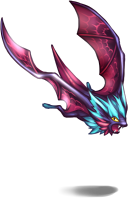
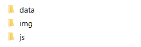
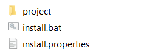
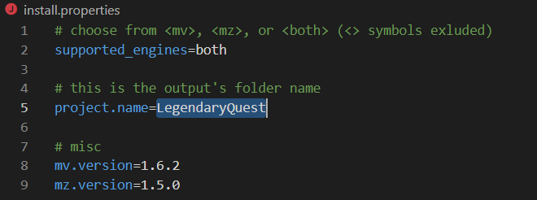

# RPG Maker Bats

# About this Project
Sometimes, you have a tiny RPG Maker Game, maybe a Sample Game, that you want to distribute to others. Your project has a size of around half a Giga Byte, but 90% is pure RTP, which every other RPG Maker Dev already owns. Maybe, you are developing a Plugin or Sample Project which is compatible for both, MV and MZ. In that case, you don't want to distribute 2 separate project folders.

Instead, you want to share only your custom project files, maps, images, audio.. and ignore the default assets. And this is what this batch-file is made for!

# How it works
Your community receives your game folder, that is free of default assets, and a batch-file to double-click.
The batch file automatically creates a new RPG Maker project using the default assets, and then copy-pastes your assets into it.
That's all.

Rules
- Your end user must own RPG Maker MV or MZ
- You can select if your project is compatible with MV, MZ, or both
- If you selected "both", your end user may choose which version to install when running the batch file

# What you need to do as Dev
1. Make a fresh new folder on your machine and cherry-pick your data, graphics, audios, plugins...

2. Call this folder **project**
3. Put my install.bat and install.properties right next to your folder (not inside it)

4. Open install.properties and change attributes to your needs

5. Now you can create your zip to contain the "projects" folder, "install.bat", and "install.properties", and upload this one for your community!
